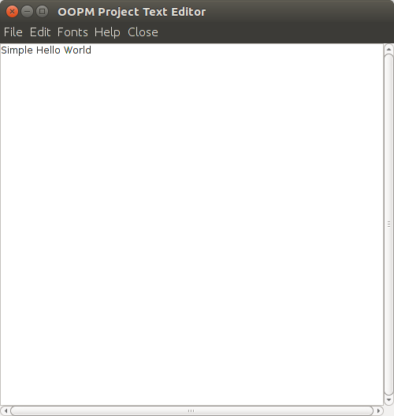

## Simple Text Editor using Swing in java

<pre>This is a simple editor using swing which have functionalities to save a file open a file.
some hot keys are currently unavailble eg for ctrl+s and ctrl+o
further other things like ctrl+x and other keys work properly</pre>

